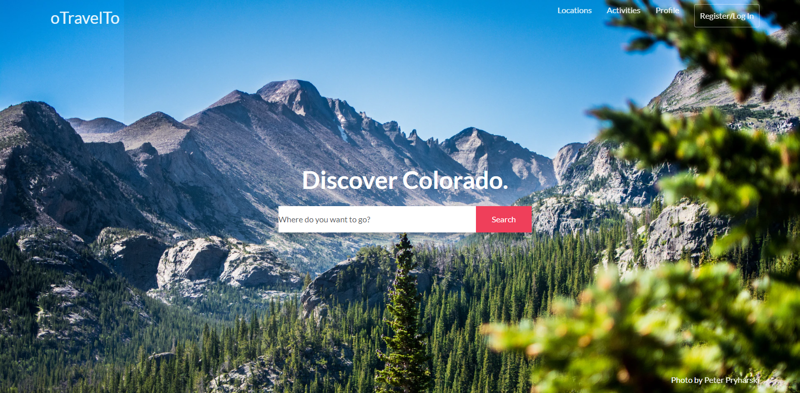

# Title: Travelto

### URL: https://project-2c.herokuapp.com/

## Description

App that lets you search and pin places you want to travel to in colorado

## Table of Contents

- [Installation](#installation)
- [Usage](#usage)
- [Future Developments](#futureDevelopments)
- [Credits](#credits)
- [Questions](#questions)

## Installation

` clone repo, npm i, node server.js, localhost:8080 `

## Usage

Used for travelling Colorado, allows user to pin locations, remove locations, and link up with other travellers

## Future Developments

get the app to function properly, currently busted but not forgotten

## Credits

- node.js

- [Express.js](https://www.npmjs.com/package/express)

- passport

- bcrypt

- [MySQL](https://www.npmjs.com/package/mysql)

- sequelize

- handlebars

- [Bootstrap](https://getbootstrap.com/)

- uniqid

- jquery

  ## Contributors:

  Nicholas C. Maas, Andrew Karpisz, Mouad Kharbach, Ben Le

  ## Questions?

  Contact me at [denvernick@hotmail.com]

  or[![Follow on Github] (https://img.shields.io/github/followers/NekoCarreraDesigns?label=Follow&style=social)](http://www.github.com/NekoCarreraDesigns)

  Copyright © 2020 Nicholas C. Maas (http://www.github.com/NekoCarreraDesigns)

  ***

  ##### \_Created with [NekoCarreraDesigns readme generator] (https://github.com/NekoCarreraDesigns/readme-generator)
